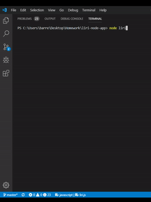

# liri-node-app

Liri-node is an application built with node.js that utilizes inquire to ask a series of questions. The application starts by asking what the user would like to search for and provides a list of options including movie, song, concert and an option to be surprised. When the user selects one of the choices, the application then prompts the user to input a search term (either a song title, movie name, or artist) then uses axios to call the associated api and print the result to the screen. The application then asks the user if they would like to play again. In the event the user chooses "surprise me", liri will use the random.txt file to provide a search term and randomly choose between the song, movie or concert data. 

## API's Used
Omdb for movie searched, Bands in Town for concerts, and Spotify to provide song data

